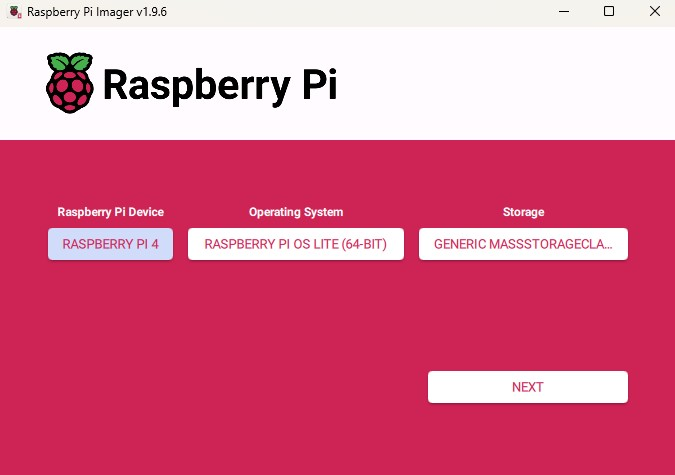
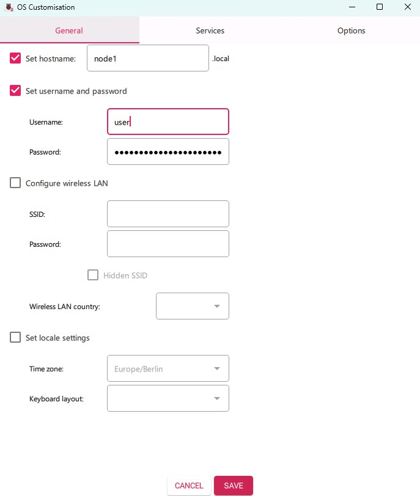
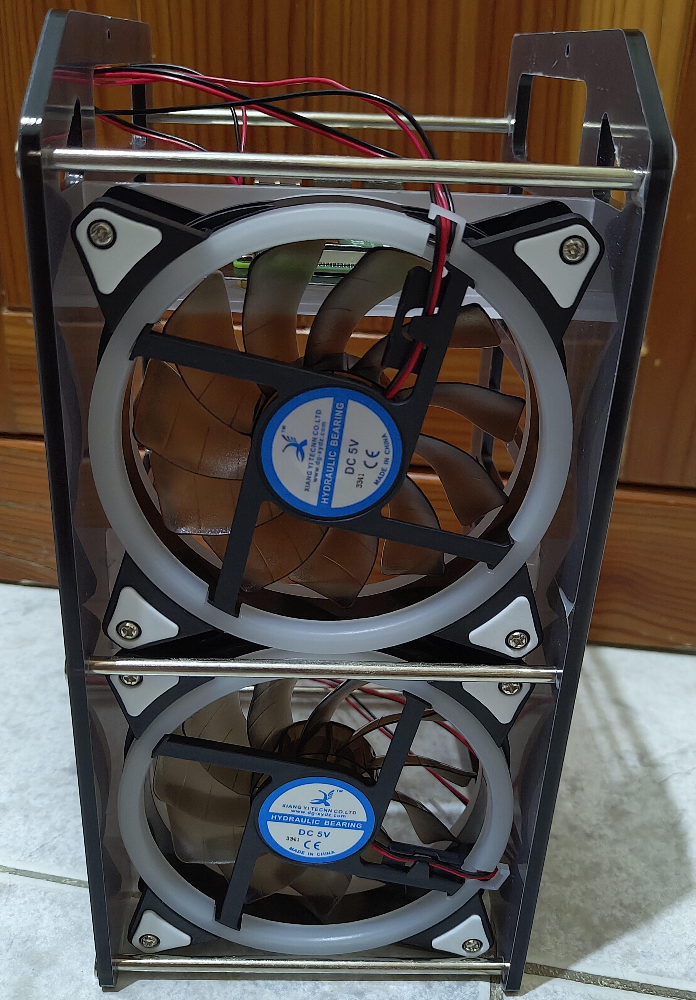
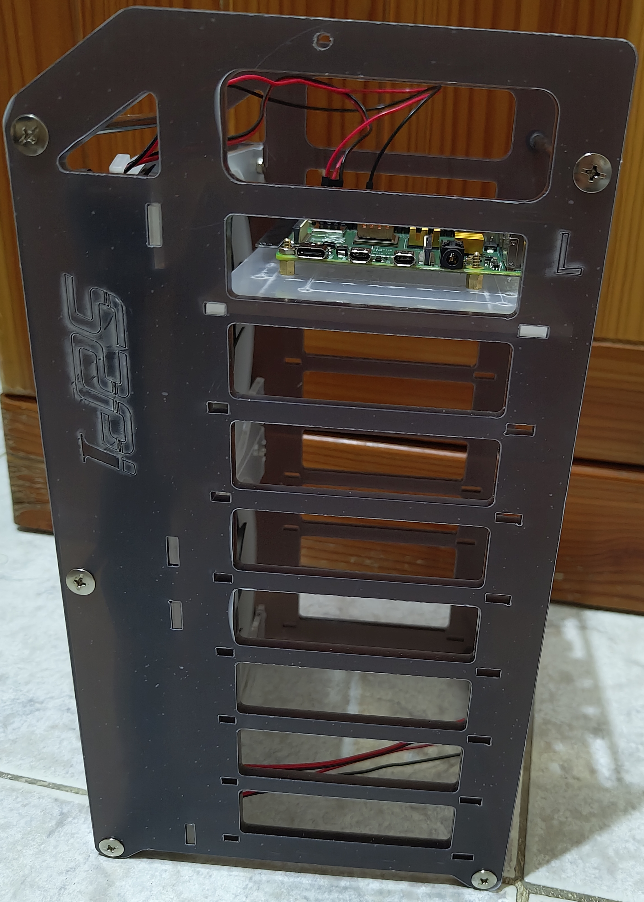

# K3s kubernetes cluster on Raspberry Pis

## Pre-requisites

- [Raspberry Pi](https://www.amazon.de/-/en/dp/B07WHWR4LH?ref_=ppx_hzsearch_conn_dt_b_fed_asin_title_1)
- [Network Switch](https://www.amazon.de/-/en/dp/B08LZJ2H9S?ref=ppx_yo2ov_dt_b_fed_asin_title&th=1)
- [PoE Hat](https://www.amazon.de/-/en/dp/B091YZ2QSM?ref=ppx_yo2ov_dt_b_fed_asin_title&th=1)
- [Raspberry Pi Rack Case](https://www.amazon.de/-/en/dp/B085ZZV66P?ref=ppx_yo2ov_dt_b_fed_asin_title&th=1)

## Phase 1 - Installing and configuring Raspberry Pi

To install OS on the Raspberry Pi I inserted the SD card in my computer and used [Raspberry Pi Imager](https://www.raspberrypi.com/software/). This software is pretty simple to use, select the Raspberry Pi model, OS and storage (SD card inserted in the beginning).



In this case I used the Raspberry Pi OS lite (64-bit), reason being is that this OS has the bare minimum and as the name indicates, it is light.

Moreover to the Raspberry Pi Imager, one can set the hostname, username, password, WLAN, time zone and keyboard layout as per screenshot below.



Once you are done from the configuration you can press next and install the OS on the SD card with preset settings.


Also, to take it to a step further, one can reserve the IP address in the DHCP with the Raspberry Pi MAC Address.

Additionally, to be more secure when connecting to the Raspberry Pi you can use keys instead of passwords. Here under are the commands to set it up.

```
# Generate a key on your local machine, you can set this with a password
ssh-keygen -o -t rsa -b 4096

# Copy the keys
ssh-copy-id <username>@<IP_Address>
```

Then on the Raspberry Pi you can switch off authentication using password in the ssh_config by disabling this `PasswordAuthentication no`.

## Phase 2 - Assembling the rack case

I mounted the rack with Raspberry Pis in phases.

First I mounted one Raspberry Pi and took 2 pictures as show below.





Then at this point I mounted the second Raspberry Pi and switched them on to make sure they connect to the local network. At this point I wasn't aware that the Raspberry Pi did not support PoE.

Here one can see that one Raspberry Pi is powered on but using the power cable.


In this picture one can visibly see that power and network cable are connected to the top one.
P.S. The rack has a cable that is inserted in the SD card to make it more accessible to put in as one could see in the bottom Raspberry Pi. (Stronlgy not recommended to remove SD card while operational)


The next picture will show that both Raspberry Pis are connected and powering on the RGB lights and fan.


At this stage, I started doing some research to discover how the Raspberry Pi can be powered on via PoE and to remove a cable out of the way. While searching I uncovered that a PoE hat was needed to support powering up without a power cable.

The following picture will show the top Raspberry Pi with a PoE hat.


Finally, the next picture will show the 3 Raspberry Pis connected via the network switch only.


## Phase 3 - Installing K3s

Select one Raspberry Pi to be the master and install the K3s by using the following command.
```
# Installing K3s
curl -sfL https://get.k3s.io | K3S_KUBECONFIG_MODE="644" sh -s -

# Checking K3s service status
systemctl status k3s
```

Once you install the K3s on the master, it will output a token which you need to save for the next step. Also, you need the IP address of the master.

To get the IP address you can use the following command or if you have set a static IP address, you would already know it.

```
# To get the IP address
ip address
```

Normally, the IP address is set on eth0 (interface).

Once you have all the details mentioned go on the worker nodes, install and configure by using this command.
```
# Installing K3s and joining the worker node to the cluster
curl -sfL https://get.k3s.io | K3S_URL=https://<Master_IP_Address>:6443 K3S_TOKEN=<Token> sh -
```